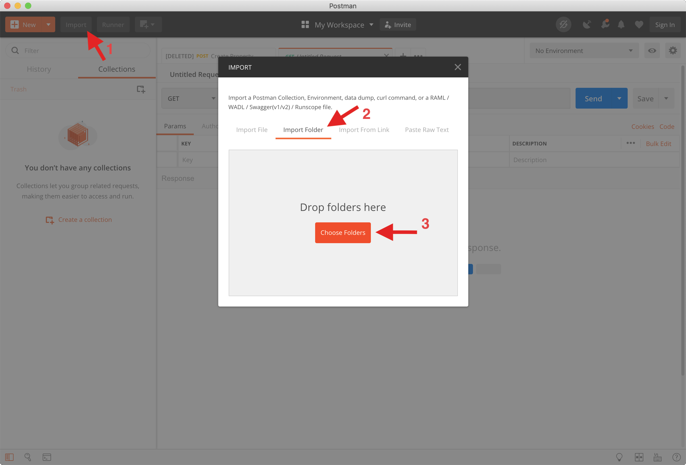
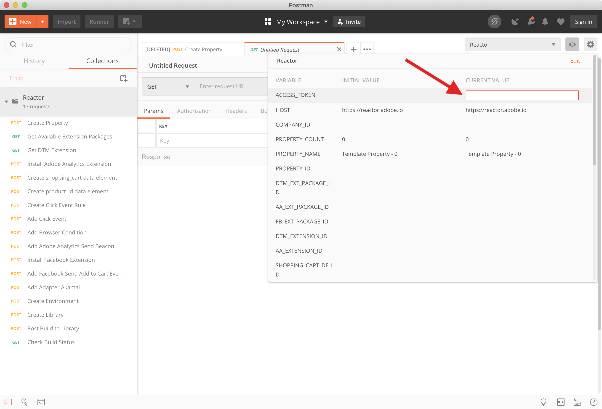
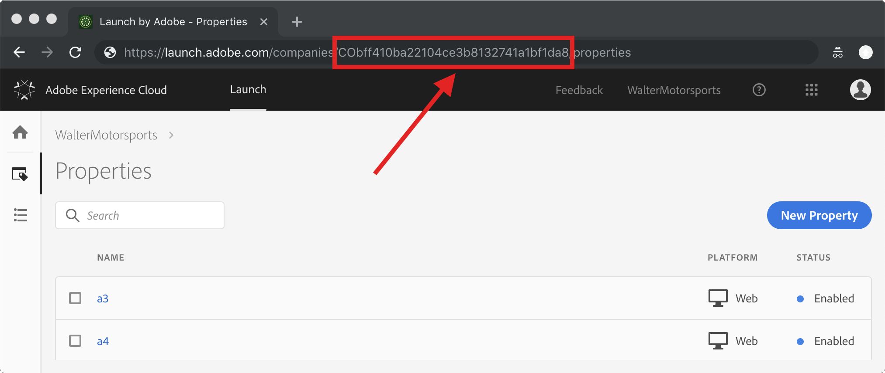
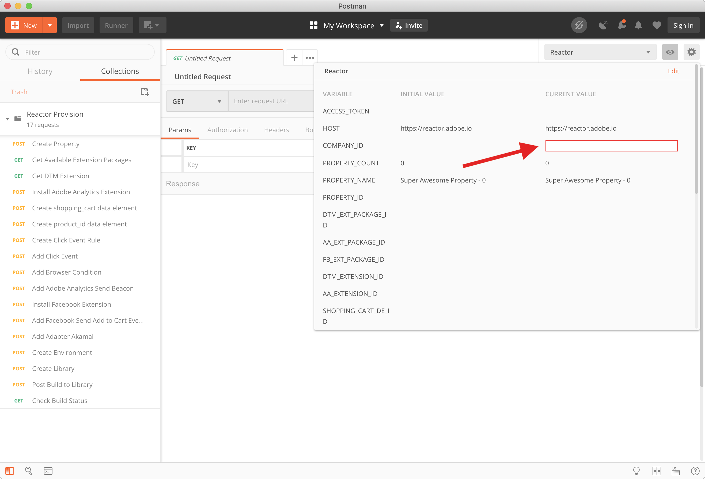

# Reactor Postman

A Postman collection of Reactor API examples for Adobe Experience Platform Launch. This collection shows a simplified use case of provisioning a new property, creating extensions rules and data elements, and initiating a library build.

Check out the [Launch Docs](https://experienceleague.adobe.com/docs/launch.html?lang=en#guides) for detailed guides and help.

## Contributing

Contributions are encouraged and welcomed! Please read the [Contributing Guide](CONTRIBUTING.md) for more information.

## Usage

To get started:

1. Install [Postman](https://www.getpostman.com/).
3. Clone the repository.
4. Import the folder into Postman
5. Set your access token
6. Set your company

## Importing the collection

You can import the entire collection and environment in one go:

## Setting the Access Token

To interact with the Launch Reactor APIs, you must have a valid access token and the correct permissions configured. The provision collection requires the development permissions to create resources and a development library. Check out the [Launch Docs](https://experienceleague.adobe.com/docs/launch.html?lang=en#guides) for more details on creating Adobe I/O integrations and permissioning.

#### Adobe I/O integration

If you have an Adobe I/O integration ready to go, the collection will automatically authenticate and set the access token variable if configured. This [walkthrough](https://experienceleague.adobe.com/docs/launch/using/extension-dev/submit/upload-and-test.html?lang=en#integration) will help you get started creating your integration

Once you've created your integration, you will need to set the following environment variables in Postman:  

* CLIENT_SECRET
* API_KEY
* IMS_HOST
* ISS
* SUB
* METASCOPE
* PRIVATE_KEY

#### Directly setting the access token

If the `ACCESS_TOKEN` variable is already set, the collection will use that value instead of trying to create one. You can directly set the `ACCESS_TOKEN` variable in your environment if you haven't/don't want to create an integration yet.

#### Setting the company id

Before you can start making calls, you also need to set the company id for your company. Technical Adobe I/O accounts are tied to a single organization/company. Ideally, we would correlate the org id to the list from a call to the [/companies](https://developer.adobelaunch.com/api/reference/1.0/companies/list/) endpoint. Until we get that in place, *cough*PR*cough*, you'll need to set it manually. You can get your company id from the Launch URL - CHECK YOUR ACTIVE ORGANIZATION TO ENSURE YOU ARE USING THE CORRECT COMPANY!

Now you can set that value in your environment

#### Running the requests

Each request builds on the previous request and demonstrates an end-to-end property creation to publish. Details on the specifications, headers, and attributes can be found for each endpoint in the [Launch Docs](https://experienceleague.adobe.com/docs/launch.html?lang=en#guides). At the completion of each request, various environment variables required for later will be set using the postman `test` and `postman.setEnvironmentVariable`

## Contributing

 Contributions are welcomed! Read the [Contributing Guide](CONTRIBUTING.md) for more information.

## Licensing

This project is licensed under the Apache V2 License. See [LICENSE](LICENSE) for more information.

